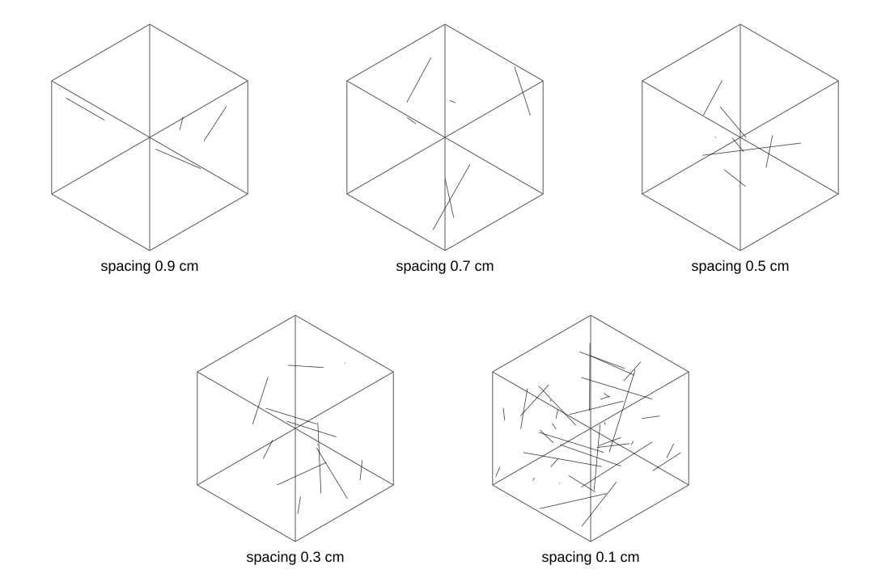

# Rock-strength Weibull model based on multifractal damage

刘树新等（2011）《基于损伤多重分形特征的岩石强度 Weibull 参数研究》的 Python 复现与扩展。

> **复现边界**：论文未给出全部原始应力–应变数据、裂纹数量与离散规则。仓库完整实现论文公开的公式和计算流程；缺失的建模约定均显式参数化，因此模拟图属于可复现实作，不宣称是论文原图的逐点重建。

## 已实现

- 表 1～表 4 的可识别数据整理；
- Mohr–Coulomb 微元强度、Weibull 损伤变量和统计损伤本构模型；
- 根据峰值条件反求 Weibull 参数 $m$ 和 $F_0$；
- 表 3、表 4 参数曲线与应力–应变曲线；
- 图 6 风格的 $m$ 敏感性分析和图 7 风格的 $F_0$ 敏感性分析；
- 基于表 1 两组产状参数的三维微裂纹 Monte Carlo 网络；
- 三维多尺度盒计数；
- Chhabra–Jensen 直接法计算 $\alpha(q)$ 和 $f(q)$；
- 自动选择无标度区并检验相关系数；
- 固定随机种子、CSV/JSON 输出、PNG/SVG 图件和自动化测试。

## 微裂纹网络图

下图由 `generate_microcrack_figure.py` 根据表 1 的两组微裂纹产状分布生成，以仓库内 SVG 文件展示 0.9、0.7、0.5、0.3 和 0.1 cm 五种间距。



```bash
python3 generate_microcrack_figure.py
```

## 安装

```bash
git clone https://github.com/jiangnan030-del/rock-weibull-multifractal-model.git
cd rock-weibull-multifractal-model
python3 -m pip install -r requirements.txt
```

依赖：Python 3.10+、NumPy、Matplotlib 和 pandas。

## 快速运行

### Weibull 参数和应力–应变模型

```bash
# 生成表格、曲线 CSV 和示例图
python3 rock_weibull_model.py

# 根据指定 lambda 反求 m、F0
python3 rock_weibull_model.py --mode solve --lambda-values 0.9293 0.9906

# 使用自定义峰值参数
python3 rock_weibull_model.py \
  --mode solve \
  --lambda-values 0.9293 \
  --E 15000 --nu 0.25 --sigma3 0 \
  --sigma1c 35 --epsilon1c 0.004 --phi-deg 35

# 导出指定 lambda 的曲线
python3 rock_weibull_model.py --mode curve --lambda-values 0.9293 0.9906
```

### 三维微裂纹与多重分形谱

```bash
python3 microcrack_multifractal.py \
  --spacing 0.5 \
  --cube-size 10 \
  --points-per-crack 300 \
  --divisions 4,5,6,8,10,12,16,20 \
  --q-min -5 --q-max 5 --q-step 0.5 \
  --correlation-threshold 0.95
```

批量计算论文中的五种间距：

```bash
for spacing in 0.1 0.3 0.5 0.7 0.9; do
  python3 microcrack_multifractal.py --spacing "$spacing"
done
```

每个间距默认输出到 `outputs/multifractal_spacing_<间距>/`：

- `microcrack_points.csv`：裂纹面采样点、裂纹编号和裂纹组；
- `box_count_scales.csv`：盒划分数、相对盒尺度和占据盒数；
- `multifractal_spectrum.csv`：$q$、$\alpha(q)$、$f(q)$、所选尺度区间、相关系数和 $R^2$；
- `summary.json`：容量维 $D_0$、相对维数 $\lambda$、谱宽、随机种子和参数；
- `microcrack_network_3d.png`：三维裂纹网络；
- `multifractal_spectrum.png`：多重分形谱。

## 论文公式

### 1. 多重分形谱

盒尺度为 $r$，第 $i$ 个盒子的概率为 $p_i(r)$，阶数为 $q$：

$$
\mu_i(q,r)=\frac{[p_i(r)]^q}{\sum_i[p_i(r)]^q}
$$

$$
f(q)=\lim_{r\to0}\frac{\sum_i\mu_i(q,r)\lg[\mu_i(q,r)]}{\lg r}
$$

$$
\alpha_i=\frac{\lg p_i(\delta)}{\lg\delta}
$$

$$
\alpha(q)=\lim_{r\to0}\frac{\sum_i\mu_i(q,r)\lg[p_i(r)]}{\lg r}
$$

容量维对应的相对分形参数为：

$$
\lambda=\frac{D_0}{3},\qquad 0<\lambda<1
$$

程序对连续尺度窗口分别拟合 $\sum_i\mu_i\ln p_i$ 和 $\sum_i\mu_i\ln\mu_i$ 关于 $\ln r$ 的直线。默认要求两个相关系数的绝对值均不低于 0.95；没有窗口通过时，结果会明确标记 `threshold_passed=false`。

### 2. 损伤本构关系

Lemaitre 应变等价关系及面积损伤变量：

$$
[\sigma']=\frac{[\sigma]}{1-D}=\frac{[C][\varepsilon]}{1-D},
\qquad D=\frac{A'}{A}
$$

引入分形损伤参数：

$$
[\sigma']=\frac{[\sigma]}{1-\lambda D}
=\frac{[C][\varepsilon]}{1-\lambda D}
$$

Weibull 概率密度及累计损伤变量：

$$
p(F)=\frac{m}{F_0}(\frac{F}{F_0})^{m-1}
\exp[-(\frac{F}{F_0})^m]
$$

$$
D=\int_0^F p(x)\,\mathrm{d}x
=1-\exp[-(\frac{F}{F_0})^m]
$$

等围压下的 Mohr–Coulomb 微元强度：

$$
F=\frac{E\varepsilon_1[(\sigma_1-\sigma_3)-(\sigma_1+\sigma_3)\sin\varphi]}
{\sigma_1-2\nu\sigma_3}
$$

轴向应力本构式：

$$
\sigma_1=E\varepsilon_1\{\lambda
\exp[-(F/F_0)^m]+1-\lambda\}+2\nu\sigma_3
$$

令

$$
A(F)=\lambda\exp[-(F/F_0)^m]+1-\lambda
$$

代码采用的参数形式为：

$$
\varepsilon_1(F)=
\frac{F-\sigma_3[2\nu(1-\sin\varphi)-(1+\sin\varphi)]/A(F)}
{E(1-\sin\varphi)}
$$

$$
\sigma_1(F)=E\varepsilon_1(F)A(F)+2\nu\sigma_3
$$

### 3. 峰值条件和 Weibull 参数反演

峰值点满足：

$$
\sigma_1=\sigma_{1c},\quad
\varepsilon_1=\varepsilon_{1c},\quad
F=F_c,\quad
\frac{\partial\sigma_1}{\partial\varepsilon_1}\vert_c=0
$$

峰值微元强度：

$$
F_c=\frac{E\varepsilon_{1c}
[(\sigma_{1c}-\sigma_3)-(\sigma_{1c}+\sigma_3)\sin\varphi]}
{\sigma_{1c}-2\nu\sigma_3}
$$

定义：

$$
R=\frac{\sigma_{1c}-2\nu\sigma_3+(\lambda-1)E\varepsilon_{1c}}
{E\varepsilon_{1c}\lambda}
$$

则：

$$
(\frac{F_c}{F_0})^m=-\ln R
$$

$$
m=-\frac{\sigma_{1c}-2\nu\sigma_3}
{\sigma_{1c}-2\nu\sigma_3+(\lambda-1)E\varepsilon_{1c}}
\frac{1}{\ln R}
$$

$$
F_0=\frac{F_c}{[-\ln R]^{1/m}}
$$

物理解要求：

$$
0<\lambda<1,\qquad 0<R<1,\qquad m>0,\qquad F_0>0
$$

> 原文交替使用 $v$ 和 $\nu$，本仓库统一使用 `nu` 表示泊松比。

## 数据与主要文件

- `data/table1_microcrack_classification.csv`：校正后的表 1；
- `data/table2_multifractal_spectrum_summary.csv`：表 2；
- `data/table3_relative_dimension.csv`：表 3；
- `data/table4_singularity.csv`：表 4；
- `rock_weibull_model.py`：Weibull 参数和本构模型；
- `microcrack_multifractal.py`：Monte Carlo、盒计数和多重分形谱；
- `generate_microcrack_figure.py`：五种间距的 SVG 网络图；
- `sensitivity_figures.py`：图 6、图 7 风格的敏感性图；
- `notebooks/rock_weibull_demo.ipynb`：Notebook 示例；
- `MONTE_CARLO_MULTIFRACTAL.md`：Monte Carlo 与多重分形算法说明。

## 验证

```bash
python3 -m unittest discover -s tests -v
python3 -m py_compile rock_weibull_model.py microcrack_multifractal.py generate_microcrack_figure.py sensitivity_figures.py
```

已检查：

- README 不再使用会触发 GitHub “Missing or unrecognized delimiter” 的动态定界符；
- 默认 Weibull 求解、曲线生成、三维裂纹模拟和多重分形输出均可运行；
- 自动化测试覆盖随机种子复现、坐标边界、盒概率归一化、均匀三维点集维数和无标度区选择。

## 已知限制

- 表 1 将迹长描述为负指数分布，同时给出的方差与标准指数分布的“方差等于均值平方”并不完全一致。实现使用表中均值作为指数尺度，并保留原方差作为元数据。
- 图 7 图注写“不同 $F_0$”，但补充图片图例写“间距 1.9～1.1 cm”，缺少二者映射；仓库中的图 7 风格曲线明确标为说明性结果。
- 表 3、表 4 的已发表 $m,F_0$ 与默认 demo 峰值参数不是同一组完整实验输入，不能把示例曲线宣称为论文原图的逐点复现。

## License

原论文及其图表版权归原作者和出版方所有。本仓库代码与整理数据仅用于研究复现和教学；若计划再发布，请补充合适的开源许可证并核对原论文授权范围。
